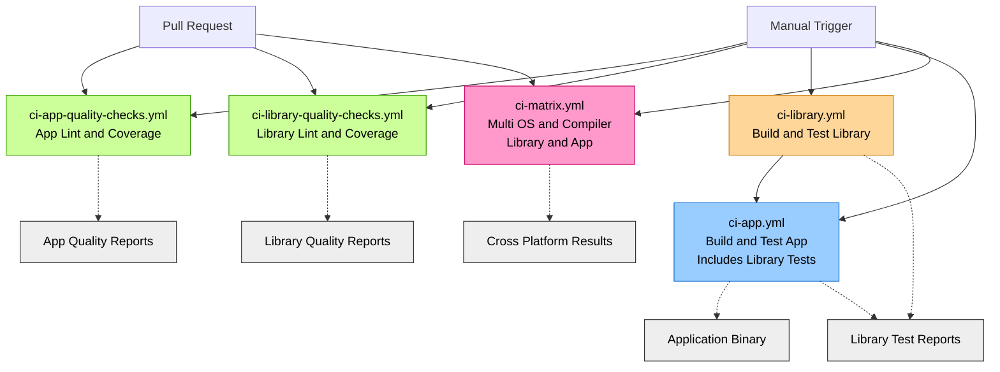

# github-actions-devops-ci-cd

## Overview

This repository is a hands-on DevOps learning project built from scratch as part of my transition from C/C++ software development to DevOps engineering.

It is inspired by concepts from Microsoft’s *GH-200T00-A: Automate your workflow with GitHub Actions* course and focuses on **CI/CD automation, reusable workflows, and production-oriented pipeline design**.

To provide a realistic workload, the project implements a **Hotel Reservation System in C++**, developed incrementally while CI/CD capabilities are introduced and refined step by step.

> This repository is intentionally not a tutorial copy.  
> All code, workflows, and structure are implemented independently to reinforce practical understanding.

---

## Main planned Application Features

- View available rooms
- Book a room
- Cancel a booking
- Calculate prices
- Apply discounts for specific nights
- Manage customer details
- Persist reservations to storage

---

## Background

I have 3 years of professional experience as a C/C++ developer.  
This project reflects my transition toward DevOps engineering by applying automation principles and CI/CD design patterns commonly used in real-world software delivery environments.

---

## Goals

- Learn and apply CI/CD concepts using GitHub Actions
- Design reusable and maintainable CI pipelines
- Separate concerns between library, application, and quality workflows
- Apply DevOps best practices (automation, testing, feedback loops)
- Build pipelines incrementally instead of copying full tutorial code

---

## Design Principles

- **Reusability** — workflows built using `workflow_call`
- **Fail fast** — library correctness gates downstream jobs
- **Maintainability** — clear structure and naming
- **Production mindset**: Pipelines designed as they would be in real-world projects  

---

## Current Status

This project is developed incrementally to mirror real-world CI/CD evolution.

Rather than implementing everything upfront, functionality and pipelines are added step by step, validated, and refined as new concepts are introduced.

---

## Initial Plan

- Build a realistic C++ codebase (library + CLI app)
- Keep application logic simple but representative
- Focus primarily on CI/CD design and workflow structure 
- Apply GitHub Actions concepts gradually
- Separate testing concerns clearly (library vs application)

---

## What Has Been Implemented So Far

- Modular CMake-based project structure
- Core **hotel library** encapsulating all business logic
- Separate **CLI application** consuming the hotel library
- Independent unit tests for the library using GoogleTest
- Application-level tests validating CLI execution and output
- Clear separation between:
  - Library build & tests
  - Application build & tests
  - Quality checks (linting and coverage)
- Application-level features implemented:
  - View all rooms in a hotel
  - Add a room to a hotel
  - View available rooms in a certain date
  - Book a room 

### CI/CD Capabilities Implemented

- GitHub Actions workflows built from scratch
- Dedicated CI workflows for:
  - Library build & test
  - Application build & test
  - Library quality checks (linting & coverage)
  - Application quality checks (linting & coverage)
  - Library CI acts as a **gate** for application CI
- Reusable workflows (`workflow_call`) to avoid duplication
- Manual-trigger workflows for controlled validation
- Path-based execution to avoid unnecessary CI runs
- Multi-platform matrix builds (OS × compiler) for robustness

---

## Testing Strategy

- **Library unit tests**
  - Test business logic in isolation
  - Run independently of the application
- **Application tests**
  - Validate CLI execution and output
  - Act as lightweight integration tests
- Tests are executable locally and in CI

---

## CI/CD Pipeline Architecture

The CI/CD design is intentionally split into **focused workflows** to reduce
redundant execution, improve feedback clarity, and mirror real-world CI setups.

The project currently uses **five GitHub Actions workflows**, each with a
specific responsibility:

### Workflows Overview

1. **ci-library.yml**
   - Builds and tests the hotel library only
   - Triggered manually only
   - Useful for focused library validation without app overhead

2. **ci-app.yml**
   - Builds and tests the CLI application
   - Currently depends on the library build
   - Triggered manually only
   - Used for controlled validation and release-style checks

3. **ci-matrix.yml**
   - Runs multi-platform matrix builds (OS × compiler)
   - Covers both library and application
   - Triggered on:
     - Pull requests (path-filtered to Application and to hotel_lib)
     - Manual execution
   - Used to validate portability and toolchain compatibility

4. **ci-app-quality-checks.yml**
   - Runs static analysis (clang-tidy) and code coverage for the application
   - Triggered on:
     - Pull requests (path-filtered to Application)
     - Manual execution
   - Provides early feedback without rebuilding everything

5. **ci-library-quality-checks.yml**
   - Runs static analysis (clang-tidy) and code coverage for the hotel library
   - Triggered on:
     - Pull requests (path-filtered to hotel_lib)
     - Manual execution
   - Ensures library correctness and quality independently

# The diagram below illustrates the current CI/CD structure:

- Entry workflows (PR / manual)
- Reusable build & test workflows
- Job dependencies
- Artifact generation

# Planned Implementations / Next Steps
| Status | Item |
|-------:|------|
| ✅ | Modular CMake project structure |
| ✅ | Hotel library with unit tests |
| ✅ | CLI application consuming the library |
| ✅ | Reusable CI workflows for library and app |
| ✅ | Multi-platform builds (Linux / macOS / Windows) |
| ✅ | Extended CI/CD documentation & diagrams |
| ⏳ | Linting and static analysis workflows |
| ⏳ | Code coverage reporting |
| ⏳ | Build caching (ccache, dependency caching) |
| ⏳ | CI cost optimizations |
| ⏳ | Security checks (dependencies, secrets) |
| ⏳ | Custom composite GitHub Actions |

# Build and Test

This project uses CMake with a standard out-of-source build.

## Configure the Project
cmake -S . -B build

### This configures:

- The hotel core library
- The CLI application
- All test targets

## Build All Targets
cmake --build build

### This builds:

- hotel_lib (core library)
- hotel_app (CLI application)
- hotel_lib_tests
- hotel_app_tests

## Run All Tests
ctest --test-dir build --output-on-failure

### This Runs:

- Library unit tests
- Application-level tests

## Build Only the Application
cmake --build build --target hotel_app

## Build Only the Library
cmake --build build --target hotel_lib

## Build and Run Library Tests Only
cmake --build build --target hotel_lib_tests

ctest --test-dir build -R hotel_lib_tests --output-on-failure

## Build and Run Application Tests Only
cmake --build build --target hotel_app_tests

ctest --test-dir build -R hotel_app_tests --output-on-failure

## Credits

Inspired by concepts from Microsoft’s official course *GH-200T00-A: Automate your workflow with GitHub Actions*: [Course Link](https://learn.microsoft.com/en-us/training/courses/gh-200t00)  

This repository is not a fork. All implementations are independent and intended for learning and demonstration purposes.
